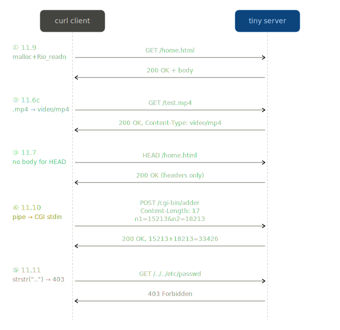

# Web Proxy Lab

CS:APP Web Proxy Lab — HTTP 프록시 서버를 밑바닥부터 구현하며 네트워크 프로그래밍, 동시성, 캐싱을 학습합니다.

---

## 📚 학습 목표

### 네트워크 기초
- [x] 네트워크 개념 & TCP/IP 계층 이해
- [x] 클라이언트-서버 모델 이해
- [x] Datagram Socket vs Stream Socket 차이 설명
- [x] 파일 디스크립터(fd) 개념 체화

### 소켓 인터페이스
- [x] `socket()` — 소켓 생성, fd 반환
- [x] `bind()` — 주소(IP+포트) 부여 (서버 전용)
- [x] `listen()` — 연결 대기 모드 전환 (서버 전용)
- [x] `accept()` — 연결 수락, 새 fd 반환 (서버 전용)
- [x] `connect()` — 서버 접속 (클라이언트 전용)
- [x] `close()` — 소켓 종료, 자원 회수

### 웹서버 & HTTP
- [x] HTTP 요청/응답 메시지 구조 이해 (시작 라인 + 헤더 + 빈 줄 + 바디)
- [x] HTTP 메서드 (GET, HEAD, POST) 구분
- [x] HTTP 상태 코드 (2xx/4xx/5xx) 의미
- [x] MIME 타입 개념
- [x] 정적 컨텐츠 vs 동적 컨텐츠
- [x] CGI 동작 원리 (fork + dup2 + execve)

### 프록시 서버
- [x] Forward Proxy vs Reverse Proxy 차이
- [x] 프록시가 "서버이자 클라이언트"인 이유
- [x] 요청 헤더 재작성 (Host, User-Agent, Connection, Proxy-Connection)
- [x] HTTP/1.1 → HTTP/1.0 변환 의미

---

## 🎯 실습 체크리스트

### Part 0: 환경 세팅

- [x] Docker 또는 Ubuntu 22.04 환경 준비
- [x] `webproxy-lab` 레포 clone
- [x] 학습용 디렉토리 생성 (`netp/`)
- [x] csapp.c, csapp.h 학습용 디렉토리로 복사
- [x] VSCode IntelliSense 설정 (`_GNU_SOURCE` 매크로 추가)
- [x] 포트 할당 도구 동작 확인 (`./port-for-user.pl`, `./free-port.sh`)

### Part 1: Echo Server/Client (소켓 기초)

- [x] CSAPP 11.1 ~ 11.4 읽기
- [x] `echoclient.c` 책 따라 작성 (CSAPP Fig 11.20)
- [x] `echoserveri.c` 책 따라 작성 (CSAPP Fig 11.21)
- [x] `echo.c` 책 따라 작성 (CSAPP Fig 11.22)
- [x] Makefile 작성 (타겟, 의존성, 컴파일 플래그 이해)
- [x] 빌드 성공 (`make clean && make`)
- [x] 두 터미널로 에코 통신 동작 확인
- [x] (선택) `hostinfo.c` 작성해서 getaddrinfo 체화

### Part 2: Tiny Web Server

- [x] CSAPP 11.5 (웹 서버) 읽기
- [x] `tiny.c` 함수 하나씩 구현 (책 Figure 11.29 ~ 11.35)
  - [x] `clienterror` — 에러 응답
  - [x] `read_requesthdrs` — 헤더 읽기
  - [x] `parse_uri` — URI 파싱
  - [x] `get_filetype` — MIME 타입 매핑
  - [x] `serve_static` — 정적 컨텐츠
  - [x] `serve_dynamic` — CGI 실행
  - [x] `doit` — 요청 처리 본체
- [x] `./tiny <port>` 빌드 및 실행
- [x] 브라우저로 `home.html` 접근 성공
- [x] 이미지 파일 (`godzilla.gif/jpg`) 렌더링 확인
- [x] CGI 동작 확인 (`/cgi-bin/adder?15213&18213`)
- [x] curl로 요청/응답 바이트 관찰 (`curl -v`)
- [x] netcat으로 수동 HTTP 요청 보내기
- [x] 에러 케이스 테스트 (존재하지 않는 파일, 미지원 메서드)

### Part 3: CSAPP Homework
영문판 2016.pdf 기준으로 작성. 현재 책 기준(개정판 3편)은 다소 다를 수 있음.
- [x] **11.6c** — MPG 비디오 타입 지원 추가
- [x] **11.7** — HEAD 메서드 지원 추가
- [x] **11.9** — `mmap` 대신 `malloc + rio_readn` 사용
- [x] **11.10** — POST 메서드 지원
- [x] **11.11** — Path Traversal 방어

#### Part 3 — 구현 플로우 & 배운 점

**11.6c (MPG 서빙) — 생각보다 브라우저 코덱이 변수였다**

접근 자체는 간단했다. `get_filetype`에 `.mpg → video/mpeg` 분기 한 줄만 추가하면 끝. `serve_static`은 이미 `Rio_writen`으로 `filesize` 바이트를 그대로 쏘기 때문에 바이너리 안전하다.

MPG 파일이 없어서 ffmpeg로 만들었는데, 첫 시도는 실패했다.
```bash
# 실패: MPEG-1은 15fps를 지원 안 함
ffmpeg -f lavfi -i testsrc=duration=10:size=320x240:rate=15 -c:v mpeg1video test.mpg
# 성공: 25fps로 생성
ffmpeg -f lavfi -i testsrc=duration=10:size=320x240:rate=25 -c:v mpeg1video test.mpg
```

MPEG-1은 1993년 표준이라 프레임레이트가 23.976/25/29.97/30/50/60 등으로 고정돼 있다.

더 큰 함정은 **브라우저가 MPEG-1을 기본 지원하지 않는다는 것**. `video.html`에서 `<video>` 태그로 띄우면 플레이어 UI는 뜨지만 재생이 안 된다. 이건 tiny 서버 문제가 아니라 브라우저 코덱 한계다. 검증은 두 갈래로:
- 서버가 올바르게 서빙하는지 → DevTools Network 탭에서 `Content-Type: video/mpeg`, 200 OK, 바이트 일치 확인
- 실제 재생 감 → MP4로도 생성해서 `.mp4 → video/mp4` 분기를 추가, `<source>` 체인으로 MP4 우선 재생

배운 점: "서버가 서빙하는 것"과 "브라우저가 렌더링하는 것"은 별개의 문제다. 과제 요구사항은 전자다.

---

**11.7 (HEAD) + 11.9 (malloc+rio_readn) — 시그니처부터 고치면 자연스럽게 따라온다**

이 둘은 `serve_static` 한 함수 안에서 같이 처리된다.
- 11.9: `mmap/Munmap` 블록을 `Malloc + Rio_readn + free`로 교체. Close 호출 순서가 바뀐다는 게 포인트 — mmap은 매핑 후 fd를 닫아도 매핑이 유지되지만, `Rio_readn`은 "읽고 나서" Close.
- 11.7: `serve_static` 시그니처에 `method` 파라미터를 추가하고, 헤더 전송 **직후 바디 전송 직전**에 `if (!strcasecmp(method, "HEAD")) return;` early return.

`doit`의 메서드 검증도 `GET && HEAD` 둘 다 허용하도록 확장.

최초 테스트 때 `curl -I`가 501 Not Implemented로 돌아와서 잠깐 당황했는데, **`-I`는 HEAD 요청**이라는 걸 상기. tiny가 아직 HEAD를 구현하지 않은 상태였기 때문에 정확히 기대대로 동작한 것. 11.7 구현 후 동일 명령으로 200 OK 떠서 회귀 확인.

한 가지 실수: malloc 버전을 추가하면서 기존 mmap 블록을 지우지 않고 남겨둬서 파일이 두 번 전송됐다. 다행히 `diff`에서 크기 불일치로 바로 잡혔다. **replace는 add+delete의 두 동작**임을 다시 깨달음.

동적 컨텐츠(CGI)의 HEAD는 구현하지 않았다. CGI 자식 프로세스가 stdout(소켓)에 바디를 쓰는 구조라, HEAD를 지원하려면 파이프로 CGI 출력을 캡처해서 바디를 잘라내야 한다. 복잡도 대비 가치가 낮아서 범위 외로 뒀다.

---

**11.10 (POST) — pipe로 CGI stdin을 연결하는 게 핵심**

POST는 tiny와 CGI 프로그램(adder.c) **둘 다** 손대야 한다. CGI/1.1 스펙상:
- GET: 쿼리 → `QUERY_STRING` 환경변수
- POST: 바디 → **stdin**, 길이 → `CONTENT_LENGTH` 환경변수, 메서드 → `REQUEST_METHOD`

tiny 쪽 흐름:
1. `read_requesthdrs`에서 `Content-Length:` 헤더 파싱 (out 파라미터로 전달)
2. `serve_dynamic`에서 POST면 `Rio_readnb`로 바디를 읽어 pipe에 기록
3. fork 후 자식에서 `Dup2(pipefd[0], STDIN_FILENO)` — stdin이 pipe read end를 가리키게 됨
4. `Dup2(fd, STDOUT_FILENO)` — 기존 GET 로직 그대로. **이걸 빼먹으면 응답이 아예 안 감**

adder.c 쪽:
- `getenv("REQUEST_METHOD")` 분기
- POST면 `fgets(query, n+1, stdin)` (n은 `CONTENT_LENGTH`)
- 이후 파싱은 GET/POST 공통

첫 시도에서 헤맨 포인트:
1. `adder.c`에 `char content[MAXLINE]`을 실수로 **두 번 선언**해버림. 전체 교체한다는 걸 깜빡하고 패치만 얹어서 생긴 문제.
2. POST 경로에서 `n1, n2`를 파싱하는 로직이 누락돼 항상 `0 + 0 = 0`이 나옴. GET/POST 공통 파싱 경로로 합쳐서 해결.
3. `sprintf(content, ..., buf)`에서 `buf`가 GET 브랜치에서만 초기화되는데 POST 경로에서도 참조돼 UB 발생 → 출력에 `QUERY_STRING=@�]�` 쓰레기 문자. `query[MAXLINE] = ""`로 공용 버퍼 도입하고 GET도 `strcpy(query, buf)`로 저장하도록 수정.
4. `strchr(query, '&')` 후 `*p = '\0'`로 잘라 파싱한 뒤 `*p = '&'`로 원상 복구. 안 그러면 QUERY_STRING 출력이 `n1=15213`에서 잘린다 (원본 GET도 같은 버그였음).

제약: pipe 버퍼가 리눅스 기본 64KB라서, 현재 구현은 바디가 64KB 넘으면 부모가 write에서 블록된다. 숙제 수준 폼 데이터(<1KB)엔 무관하지만 프로덕션 프록시라면 fork 후 부모/자식이 동시에 주고받는 구조로 가야 한다.

검증:
```bash
# GET
curl "http://localhost:8000/cgi-bin/adder?n1=15213&n2=18213"
# POST
curl -v -X POST -d "n1=15213&n2=18213" http://localhost:8000/cgi-bin/adder
# 둘 다 "The answer is: 15213 + 18213 = 33426"
```

---

**11.11 (Path Traversal) — 검증 도구가 오히려 방어를 우회한다**

구현은 `doit`의 `parse_uri` 직전에 한 줄.
```c
if (strstr(uri, "..")) {
  clienterror(fd, uri, "403", "Forbidden", "Path traversal not allowed");
  return;
}
```

재미있었던 건 검증 방식. 처음에 `curl "/../../etc/passwd"`로 테스트했더니 403이 아니라 404가 떴다. 처음엔 방어 로직이 틀린 줄 알았는데, tiny 쪽 로그를 보니:
```
GET /etc/passwd HTTP/1.1
```

**curl이 요청을 보내기 전에 URI를 정규화**해서 `..`를 이미 없앤 후 보낸 것. 그래서 서버의 `strstr(uri, "..")` 방어까지 도달하지도 못하고, `./etc/passwd`로 stat → 파일 없음 → 404 경로를 탔다.

서버 방어 자체는 맞다는 걸 확인하려면 raw 요청을 보내야 한다:
```bash
# 방법 1: --path-as-is로 curl의 정규화 비활성화
curl -v --path-as-is "http://localhost:8000/../../etc/passwd"
# 방법 2: netcat
printf 'GET /../../etc/passwd HTTP/1.0\r\n\r\n' | nc localhost 8000
```

이때 비로소 403 Forbidden이 떴다. 배운 점: **클라이언트 도구가 서버 동작을 가린다**. 서버 테스트할 때는 raw 레벨 도구(netcat, `--path-as-is`, 수제 HTTP 요청)를 확보해둬야 한다.

방어 수준 자체는 최소 방어다. `strstr(uri, "..")`는 정상 파일명에 `..`가 포함된 경우(예: `my..file.txt`)도 차단해버리는 오버블로킹이 있고, 진짜 안전한 방어는 document root 기반으로 `realpath`를 비교하는 것. 숙제 범위에서는 최소 방어로 충분.

#### 숙제 이후 시퀀스


---

### Part 4: Proxy — Sequential (순차 처리)### Part 4: Proxy — Sequential (순차 처리)

- [x] Proxylab PDF 정독
- [x] `proxy.c` 구조 설계 (doit / parse_uri / build_requesthdrs 분리)
- [x] 리스닝 소켓 열기 (`Open_listenfd`)
- [x] accept 루프 구현
- [x] 클라이언트 요청 라인 파싱
- [x] URI에서 host/port/path 분리
- [x] 요청 헤더 읽기 및 재작성
  - [x] Host 헤더 처리 (브라우저 것 유지, 없으면 추가)
  - [x] User-Agent 고정 문자열로 치환
  - [x] Connection: close 설정
  - [x] Proxy-Connection: close 설정
  - [x] 나머지 헤더는 그대로 전달
- [x] HTTP/1.1 → HTTP/1.0 변환
- [x] 타겟 서버 접속 (`Open_clientfd`)
- [x] 요청 전달
- [x] 응답 수신 및 클라이언트로 전달 (바이너리 데이터 주의)
- [x] curl로 테스트 (`curl -v --proxy http://localhost:PORT http://...`)
- [x] `./driver.sh` Basic 40/40 통과

#### Part 4 — 구현 플로우 & 배운 점

**Tiny → Proxy: 역할의 전환 — 콘텐츠 생산자에서 중계자로**

Tiny를 만든 경험이 Proxy 설계의 기반이 됐는데, **구조는 비슷해 보여도 역할이 완전히 다르다**는 걸 일찍 깨달은 게 컸다. 겉으로는 둘 다 accept 루프 + doit 구조지만, doit 내부에서 하는 일이 근본적으로 다르다.

| 측면 | Tiny | Proxy |
|---|---|---|
| 역할 | 콘텐츠 생산자 | 중계자 |
| 응답 출처 | 서버 디스크의 파일 | 다른 서버의 응답 |
| 주요 활동 | 요청 파싱 → 파일 읽기 → 응답 조립 | 요청 파싱 → 백엔드 전달 → 응답 중계 |
| 소켓 역할 | 서버 전용 | 서버 + 클라이언트 |
| 관리할 fd | 1개 (connfd) | 2개 (clientfd + serverfd) |
| RIO 버퍼 | 1개 | 2개 (각 fd마다) |
| URI 의미 | 파일 경로 (`/home.html`) | 전체 URL (`http://host:port/path`) |


---

**parse_uri — Tiny와 이름만 같고 알고리즘은 완전히 다름**

Tiny의 `parse_uri`는 `/cgi-bin/adder?n1=15213`을 받아 정적/동적 판별 + 쿼리 분리를 했다. Proxy의 `parse_uri`는 `http://host:port/path` 형태의 전체 URL을 받아 세 조각으로 분해해야 한다. 이름만 같지 입력·출력·알고리즘 전부 다르다.

알고리즘 설계에서 두 가지 결정이 있었다:

**1. `/` 먼저 찾고 그 다음 `:` 찾기**

`:`을 먼저 찾으면 포트 생략된 URL(`http://example.com/page`)에서 NULL 케이스를 분리해 다시 생각해야 했다. `/`를 먼저 기준선으로 그어 path를 분리하면, 남은 영역(host:port)만 `:`으로 쪼개면 된다. 영역을 먼저 제한한 뒤 내부를 쪼개는 순서가 깔끔했다.

**2. `strchr` 대신 범위 제한 for 루프**

`:` 찾을 때 `strchr`을 쓰면 문자열 끝까지 뒤지기 때문에, path 안에 `:`이 있으면 오인식할 수 있다. 원본 `uri`를 수정해 임시 `\0`을 넣는 방법도 있지만, **원본을 건드리지 않는 게 안전**하다고 판단해 for 루프로 `hostbegin`부터 `hostend`까지 범위 제한 순회했다.

엣지 케이스 3개 — `http://` 아닌 URI, path 생략(`/` 기본값), port 생략(`80` 기본값) — 를 따로따로 처리. 6개 테스트 케이스 모두 통과 후 doit 통합.

`strncpy` 사용에서 C의 "편의와 안전의 트레이드오프"를 다시 체감했다. `strcpy`는 `\0` 만날 때까지 복사해버리니 원본 uri가 통째로 들어오는데, 일부만 잘라 써야 하니 `strncpy + 수동 '\0'` 패턴이 필요하다. `strncpy`는 소스가 n보다 길면 **null 종결을 안 해주는** 함정이 있어서 `hostname[len] = '\0'`을 빼먹으면 안 된다. 현대 C 코드는 `snprintf`를 선호하지만, 이 함수는 포인터 연산과 길이 계산을 함께 연습하는 게 목적이라 의도적으로 `strncpy`를 썼다.

---

**build_requesthdrs — "루프 안"과 "루프 밖"의 구분**

이 함수에서 가장 크게 배운 건 **알고리즘의 루프 내/외 분리**다. 첫 구현에서 모든 로직을 while 루프 안에 넣었다가, User-Agent와 Connection 헤더가 헤더 수만큼 반복 추가되는 버그를 만들었다. 브라우저가 보낸 헤더가 4줄이면 최종 newreq에 `User-Agent: Mozilla...`, `Connection: close`, `Proxy-Connection: close`, 빈 줄이 각각 4번씩 들어가는 식이다.

올바른 구조:
- **루프 안**: 각 헤더에 대한 분류 작업 (그대로 전달? 버림? 보관?)
- **루프 밖**: 전체 헤더를 다 본 후 한 번만 할 마무리 (고정 헤더 추가, 빈 줄 종료)

이걸 고치고 나서도 또 하나 놓쳤다. `Host:`만 따로 처리하고 "나머지는 그대로 전달"했는데, 그 "나머지"에 User-Agent, Connection, Proxy-Connection이 다 포함돼 있었다. **브라우저 버전과 우리 버전이 둘 다 newreq에 들어가** 중복. 세 헤더를 `continue`로 버리는 분기를 추가하고서야 해결.

재구성된 최종 구조:
```
for each header line:
if 빈 줄: break (헤더 끝)
if Host:  → newreq에 추가, has_host 표시, continue
if User-Agent/Connection/Proxy-Connection: → 버림, continue
else: newreq에 그대로 추가 (Accept, Cookie 등)
루프 끝 후:
if not has_host: Host 헤더 추가
user_agent_hdr 추가 (고정)
Connection: close 추가
Proxy-Connection: close 추가
\r\n (빈 줄)
```
배운 점: **헤더 분류를 "수용(accept) + 거부(reject) + 기본값(default)"의 3단 게이트**로 생각해야 한다는 것. "Host는 특수처리, 나머지는 통과"식의 2단 분류는 숨은 케이스를 놓치기 쉽다.

---

**응답 전달 — Rio_readnb를 반드시 써야 하는 이유**

driver.sh의 basic 테스트 대상은 `home.html`, `csapp.c`, `tiny.c`, `godzilla.jpg`, `tiny` 다섯 개. 앞 셋은 텍스트지만 `godzilla.jpg`는 이미지이고 `tiny`는 **실행 바이너리**다. 이걸 그대로 중계하려면 응답 바디에 `Rio_readlineb`를 쓰면 안 된다. 바이너리 데이터 중에 우연히 `0x0A`가 있으면 readlineb가 "줄 끝"으로 오인해 버퍼링이 어긋나고, diff에서 실패한다.

```c
while ((n = Rio_readnb(&server_rio, buf, MAXLINE)) > 0) {
    Rio_writen(clientfd, buf, n);
}
```

요청 라인과 헤더는 텍스트니까 readlineb, 응답 바디는 바이너리 가능성 때문에 readnb. 이 구분이 Proxy 구현의 핵심 디테일이다.

바이트 경계가 안 지켜지는 TCP의 특성상, "한 번의 readnb가 전체 응답을 가져온다"고 가정할 수 없다. while 루프로 `readnb`가 0을 반환(EOF = 백엔드가 연결 종료)할 때까지 반복해야 완전한 중계가 된다. 백엔드에 `Connection: close`를 강제로 설정한 게 여기서 의미를 가진다 — Content-Length 헤더 파싱 없이 "연결 끊기"를 응답 끝으로 삼을 수 있다.

---

**fd/rio_t 2개 관리 — 서버이자 클라이언트의 구조**

doit 함수 내부에 관리해야 할 자원이 Tiny보다 2배가 됐다:
- `clientfd` + `client_rio`: 브라우저 쪽 연결
- `serverfd` + `server_rio`: 백엔드 쪽 연결

각 연결마다 **독립된 rio_t가 필요**하다. 한 `rio_t`는 하나의 fd에 귀속된 8KB 내부 버퍼를 들고 있어서, 같은 rio_t를 다른 fd로 재초기화하면 이전 fd의 남은 바이트가 섞여 버그가 된다.

자원 관리 책임도 분리:
- `clientfd`: main이 accept하고 main이 close (Tiny와 동일)
- `serverfd`: doit이 Open_clientfd로 열고 doit 끝에서 close

close를 빼먹으면 fd 누수로 "Too many open files" 에러가 나는데, Part 2 concurrency에서 스레드 수천 개 돌리면 바로 드러나는 버그다. Part 1에서부터 `Close(serverfd)`를 빼먹지 않도록 의식하며 구현.

---

**테스트 전략 — parse_uri 단독 테스트**

doit 전체를 다 짜놓고 테스트하면 어디서 터졌는지 찾기 어렵다. parse_uri를 먼저 작성한 뒤 main 상단에 임시 테스트 함수를 넣어 단독 검증했다:

```c
void test_parse_uri() {
    char hostname[MAXLINE], port[MAXLINE], path[MAXLINE];
    char *cases[] = {
        "http://www.cmu.edu:8080/hub/index.html",
        "http://www.cmu.edu/hub/index.html",
        "http://localhost:15213/home.html",
        "http://example.com/",
        "http://example.com",
        "ftp://invalid.com/"
    };
    // 각 케이스 parse_uri 호출 후 결과 출력
}
```

테스트 통과 확인 후 `exit(0)`으로 main을 막아두고 parse_uri만 검증. 6개 케이스 다 맞으면 삭제하고 실제 doit 통합으로 넘어갔다. **파싱 함수는 단위 테스트가 가장 효과적**이라는 걸 재확인. Tiny 때는 전체 통합 테스트(curl로 home.html 받기)밖에 안 했는데, 이번처럼 파싱 로직이 분기 많은 함수는 단위 테스트가 디버깅 시간을 크게 줄인다.

**driver.sh 통과 기준 해석**

basic 테스트 로직을 읽어본 게 구현 방향에 도움이 됐다:

1. Tiny 직접 호출로 파일 다운로드 → .noproxy/ 에 저장
2. Proxy 경유로 같은 파일 다운로드 → .proxy/ 에 저장
3. diff -q로 두 파일 비교

**프록시가 응답을 변조 없이 그대로 전달하면 통과**. 이 심플한 기준이 있으니 구현 목표가 명확해졌다 — HTTP/1.1 → HTTP/1.0 다운그레이드를 하면서도 **바디는 한 바이트도 손상 없이** 전달해야 한다. 헤더를 아무리 자유롭게 재작성해도 바디는 통과여야 한다는 것. 텍스트/이미지/실행 바이너리 5개 모두 identical 판정 받아 40/40 획득.


### Part 5: Proxy — Concurrency (동시성)

- [x] CSAPP 12장 (동시 프로그래밍) 읽기
- [x] `pthread_create` + `pthread_detach` 패턴 이해
- [x] `connfd`를 힙에 복사하여 스레드에 전달 (race condition 방지)
- [x] 멀티스레드 요청 처리 구현
- [x] SIGPIPE 무시 처리 (`Signal(SIGPIPE, SIG_IGN)`)
- [x] EPIPE, ECONNRESET 에러 graceful 처리
- [x] 메모리 누수 없음 (valgrind 확인 권장)
- [x] fd 누수 없음 (모든 경로에서 close)
- [x] `./driver.sh` Concurrency 테스트 통과

#### Part 5 — 구현 플로우 & 배운 점

**왜 동시성이 필요한가 — iterative 서버의 한계**

Part 1의 sequential proxy는 accept 루프에서 `doit()`이 끝나야 다음 요청을 받는 구조다. 이 상태에서 백엔드가 느리거나 무응답이면 **다른 모든 요청이 대기**한다. driver.sh의 concurrency 테스트가 이 시나리오를 정확히 찌른다 — 응답하지 않는 `nop-server.py`에 요청을 보낸 상태에서 동시에 Tiny로 요청을 보내, 두 번째 요청이 첫 번째에 막히지 않고 처리되는지 확인한다.

해결책은 각 요청을 별도 실행 흐름으로 분리하는 것. 세 선택지가 있다:

| 방식 | 장점 | 단점 |
|---|---|---|
| 멀티프로세싱 (fork) | 격리, 안전 | 생성 비용 높음, 캐시 공유 어려움 (IPC 필요) |
| 멀티스레딩 (pthread) | 생성 비용 낮음, 메모리 공유 쉬움 | race condition 위험 |
| 이벤트 루프 (select/epoll) | 가장 가벼움 | 구현 복잡도 높음 |

Proxylab은 멀티스레딩을 선택한다. 이유는 Part 3 캐시가 **모든 스레드가 공유하는 전역 자원**이어야 하기 때문. fork로 가면 프로세스 간 공유 메모리 API를 따로 써야 하는데 과제 범위를 넘어간다. thread는 전역 변수를 그대로 공유할 수 있고, 대신 동기화 책임이 생긴다. 이 트레이드오프를 받아들이는 게 이번 파트의 핵심.

---

**pthread_create + pthread_detach 패턴 — "만들고 놓아주기"**

스레드도 fork의 좀비 문제와 같은 구조를 가진다. 스레드가 종료되면 커널이 "이 스레드는 이렇게 끝났다"는 정보를 보관하고, 누군가 회수해 가기 전까지 유지된다. 회수 방법은 둘:

- `pthread_join(tid, ...)` — 메인이 스레드 종료를 **기다렸다가** 회수 (fork의 `wait`와 대응)
- `pthread_detach(tid)` — "내 정리는 OS에 맡긴다" 선언, 기다릴 필요 없음

Proxy의 accept 루프에 `pthread_join`을 쓰면 메인이 스레드 끝날 때까지 대기하느라 **다음 accept를 못 한다**. 동시성이 깨진다. 그래서 **detach가 필수**.

detach를 호출하는 위치는 두 가지 선택 가능하다:
- 메인에서 `pthread_create` 직후 `pthread_detach(tid)` 호출
- 스레드 자신이 시작하자마자 `pthread_detach(pthread_self())` 호출

CSAPP은 후자를 쓰는데, 스레드의 생명주기 관리를 스레드 함수 하나에 캡슐화해서 main이 실수로 detach를 빼먹지 않게 하는 설계 의도다. `pthread_self()`는 자기 자신의 스레드 ID를 반환하는 관용구 — Java의 `Thread.currentThread()`와 비슷한 역할.

```c

문법적으론 문제 없다. 하지만 런타임에 치명적이다:
시각  메인                        스레드 1          스레드 2
────  ──────────────────         ────────────     ────────────
t=0   connfd = 4 (A 요청)
t=1   pthread_create(..., &connfd)
t=2                                시작됨, 아직 *vargp 안 읽음
t=3   (다음 루프)
t=4   connfd = 5 (B 요청)  ← 덮어쓰기!
t=5   pthread_create(..., &connfd)
t=6                                *vargp 읽음 → 5 !!
(4를 처리해야 했음)
t=7                                                   *vargp 읽음 → 5
결과: A 요청(fd 4)는 아무도 처리 안 함, B 요청(fd 5)는 두 스레드가 동시 처리

두 가지 재앙이 동시에 터진다:

1. **요청 누락**: fd 4는 Accept됐지만 어느 스레드도 처리하지 않음 → 클라이언트 무한 대기
2. **데이터 경합**: 두 스레드가 같은 fd(5)에 동시 read/write → 버퍼 내용 섞이고 응답 바이트 interleaving

이게 **race condition**이다. "race" = 경주, 누가 먼저 도달하느냐에 따라 결과가 달라진다. 재현이 어려운 게 특징이다:
- 요청 1개만 보낼 땐 안 터짐 (덮어쓸 기회가 없음)
- 디버거로 단계 실행하면 타이밍이 달라져서 안 터짐 — **하이젠버그**
- 부하 상황에서 간헐적으로만 터짐

눈에 안 보이는데 재현도 안 되는 버그가 제일 위험하다. 그래서 **구조적으로 막는 게** 맞다. 힙 복사로.

```c
int *connfdp = Malloc(sizeof(int));         /* 매번 새 주소 */
*connfdp = Accept(listenfd, ...);            /* 값 저장 */
pthread_create(&tid, NULL, thread, connfdp); /* 힙 주소 전달 */
```

`Malloc`은 매번 다른 힙 주소를 반환한다. 스레드 1의 주소와 스레드 2의 주소가 겹칠 일이 없다. 그리고 스레드는 받자마자 스택에 로컬 복사:

```c
int connfd = *((int *)vargp);    /* 스택에 복사 */
Free(vargp);                      /* 이제 힙 해제해도 됨 */
```

이후 `connfd`는 이 스레드의 스택에만 존재. 다른 스레드가 절대 볼 수 없는 완전 격리 영역. **"공유하지 않는다"**가 가장 확실한 race 방지책이다.

이 경험에서 얻은 일반 원칙: **공유하지 말거나, 공유하면 동기화하라**. Proxy의 fd는 "공유 안 하기"(힙 따로 할당)를 선택했고, Part 3의 캐시는 어쩔 수 없이 공유해야 하니 "동기화"(rwlock)를 선택할 예정. 같은 문제에 두 가지 해결 방식을 한 과제에서 다 써본다.

---

**SIGPIPE 무시 — 조용한 킬러**

Proxy가 클라이언트에 응답 쓰는 중 클라이언트가 갑자기 연결을 끊으면(curl Ctrl+C, 브라우저 탭 닫기, 타임아웃 등), OS가 `SIGPIPE` 시그널을 발생시킨다. **기본 동작은 프로세스 즉시 종료**. 한 요청의 사소한 문제로 **Proxy 전체가 죽고, 그 안의 모든 스레드가 함께 사라진다**. 동시성 서버에서 가장 치명적인 failure 모드.

해결은 한 줄:
```c
Signal(SIGPIPE, SIG_IGN);
```

main 시작 부분에 한 번만. 이후엔:
- SIGPIPE 발생해도 프로세스는 살아있음
- `Rio_writen`이 에러 반환 (errno = EPIPE)
- 해당 스레드는 에러 나도 function return → detach 덕분에 자원 정리
- 다른 스레드와 메인은 영향 없음

`Signal()`은 csapp이 제공하는 래퍼인데, POSIX `sigaction`을 내부적으로 써서 이식성 있게 시그널 핸들러를 설정한다. 이걸 그냥 `signal()`로 쓰면 시스템마다 재설정 필요 여부가 달라서 버그 날 수 있다는 게 CSAPP 8장 내용.

---

**accept 루프의 최종 구조**

변경 전 (Sequential):
```c
while (1) {
    clientfd = Accept(listenfd, ...);
    doit(clientfd);
    Close(clientfd);
}
```

변경 후 (Concurrent):
```c
while (1) {
    int *connfdp = Malloc(sizeof(int));
    *connfdp = Accept(listenfd, ...);
    Pthread_create(&tid, NULL, thread, connfdp);
}
```

코드 분량은 거의 같은데 의미 변화가 크다:
- 메인은 **accept만 전담**. doit 안 함. 받자마자 다음 받기.
- 스레드는 **각자 독립**. 힙 주소 받아 로컬 복사 후 자기 일.
- 메인과 스레드의 유일한 통신 채널은 **힙에 저장된 connfd 값**. 주고받고 나면 끝.

한 번 만들어두면 "동시 요청" 상황이 저절로 해결되는 구조. 특별한 스케줄링 로직 없이 OS가 알아서 스레드 분배해준다.

---

**테스트 — 동시성이 실제로 동작하는지 눈으로 확인**

driver.sh 자동 채점 외에, 동시성이 진짜로 일어나는지 육안 확인도 했다. 터미널 3개:

```bash
# Tiny 백엔드
cd tiny && ./tiny 15213

# Proxy
./proxy 15214

# 동시에 두 요청 (백그라운드)
curl --proxy http://localhost:15214 http://localhost:15213/home.html &
curl --proxy http://localhost:15214 http://localhost:15213/home.html &
```

Proxy 터미널에 `Accepted connection from ...` 로그가 **두 줄 연속으로** 찍히면 동시 접속 받은 것. Sequential이면 첫 번째 요청 처리 끝나야 두 번째 "Accepted" 떴을 테고, Concurrent면 거의 동시에 뜬다. 이 차이를 직접 보면 동시성이 추상적 개념에서 관찰 가능한 현상이 된다.

driver.sh 점수:

basicScore: 40/40
concurrencyScore: 15/15
cacheScore: 0/15   ← Part 6에서
totalScore: 55/70

---

**정리된 질문 — 내가 답할 수 있어야 하는 것들**

면접/발표 대비로 정리:

1. **Proxy가 왜 thread를 쓰는가, process(fork)가 아닌가?**
   - 생성 비용 낮음. Part 3 캐시 공유 위해 같은 메모리 공간 필요.

2. **왜 connfd를 힙에 복사하는가?**
   - 메인 루프의 지역 변수는 다음 루프에서 덮어써져서 스레드가 잘못된 값 읽음 (race condition). 매번 다른 힙 주소를 쓰면 스레드끼리 간섭 없음.

3. **왜 pthread_detach인가, pthread_join은 안 되나?**
   - join은 메인이 기다림 → 다음 accept 못 함 → 동시성 파괴.
   - detach는 OS가 자동 정리 → 메인은 받자마자 다음 요청으로.

4. **왜 SIGPIPE 무시인가?**
   - 클라이언트가 갑자기 끊으면 SIGPIPE로 프로세스 죽음. 동시성 서버에서 한 요청 때문에 전체가 죽는 건 치명적. 무시하면 write가 에러 반환만 하고 해당 스레드만 에러 처리.

5. **race condition의 일반적 해결 전략은?**
   - "공유하지 말거나, 공유하면 동기화." Proxy는 fd를 "공유 안 하기"(힙 독립 할당), 캐시는 "공유하면서 동기화"(rwlock).

### Part 6: Proxy — Cache (캐시)

- [x] CSAPP 12.5 (스레드 동기화) 읽기
- [x] 캐시 자료구조 설계 (연결 리스트 권장)
- [x] MAX_CACHE_SIZE (1MiB), MAX_OBJECT_SIZE (100KiB) 상수 준수
- [x] 캐시 key 정의 (URI 기반)
- [x] `cache_get` — 캐시 조회
- [x] `cache_put` — 캐시 저장
- [x] LRU (혹은 근사 LRU) eviction 정책
- [x] 응답 전달 중 캐시 버퍼에 누적
- [x] MAX_OBJECT_SIZE 초과 시 캐시 포기 (전달은 계속)
- [x] Readers-Writers 동기화 구현
  - [x] `pthread_rwlock` 사용 또는 세마포어 직접 구현
  - [x] 다중 reader 동시 접근 허용
  - [x] writer는 단독 접근
- [ ] (선택) 모듈 분리 (`cache.c`, `cache.h`)
- [x] `./driver.sh` Cache 테스트 통과

#### Part 6 — 구현 플로우 & 배운 점

**왜 캐싱인가 — 백엔드 왕복을 줄이는 구조**

Part 1~2의 Proxy는 같은 URL을 100번 요청해도 **100번 모두 백엔드**로 다녀온다. 클라이언트 입장에서는 응답이 늦고, 백엔드 입장에서는 불필요한 부하가 누적된다. 캐시는 "한 번 받은 응답은 메모리에 보관했다가 재요청 시 즉시 반환"하는 구조로 이 왕복을 제거한다.

driver.sh의 캐시 테스트는 이 개념을 영리하게 검증한다:
1. Tiny를 띄우고 Proxy로 몇 개 파일 요청 → 캐시에 저장됨
2. **Tiny를 kill**
3. 같은 파일을 Proxy에 다시 요청
4. 캐시에서 반환되면 성공 — **백엔드가 죽어있어도 응답이 나오는 게 증거**

백엔드 없이 응답 나오면 "진짜 캐시에서 나온 것"이 확실해진다. 단순하지만 본질적인 테스트.
MAX_CACHE_SIZE / MAX_OBJECT_SIZE = 1,049,000 / 102,400 ≈ 10개

최대 10개 엔트리면 linear search가 O(10) = 실질적 O(1)과 차이 없음. 해시는 구현 복잡도가 높아 ROI가 낮다.

**이중 연결 리스트가 LRU에 적합한 이유**:
- head에 삽입 / tail에서 제거 모두 O(1)
- 중간 노드 제거 시 prev/next 포인터 조작만으로 O(1)
- 배열 기반은 중간 제거 시 shift 필요 → O(n)

엔트리 구조:
```c
typedef struct cache_entry {
    char uri[MAXLINE];           /* 키 */
    char *data;                   /* 응답 바이트 (Malloc) */
    int size;                     /* 데이터 크기 */
    struct cache_entry *prev;
    struct cache_entry *next;
} cache_entry_t;
```

`uri`는 고정 배열 (strcmp로 비교 편의), `data`는 포인터 + Malloc (응답 크기가 가변적이라 동적 할당). 이 분리가 자연스러웠다.

---

**cache_find — LRU 이동을 뺀 이유 (동기화 트레이드오프)**

처음 설계할 때는 cache_find에 LRU 갱신을 넣었다. "캐시 히트 시 해당 노드를 head로 이동"하는 전통적 LRU 방식. 13줄 정도의 리스트 조작 코드.

문제는 **동기화 패턴과 충돌**이었다:
- cache_find가 호출되는 컨텍스트는 **다중 reader 동시 허용(rdlock)**
- 하지만 LRU 이동은 리스트 구조를 변경하는 **쓰기 작업**
- rdlock 상태에서 쓰기를 하면 두 스레드가 동시에 같은 노드를 이동시키며 **리스트 깨짐**

해결 두 가지 선택지:
- **옵션 A**: cache_find에서 LRU 이동 제거 (순수 읽기로 만들기)
- **옵션 B**: doit에서 cache_find를 wrlock으로 보호 (정확한 LRU 유지, 동시성 손해)

옵션 A 선택. 이유:
- **driver.sh 채점에 영향 없음** (LRU 순서 정확도는 테스트 범위 밖)
- **Readers-Writers 의미 유지** (동시 읽기 가능해야 성능 이득)
- LRU는 **cache_insert에서 head에 넣는 것**으로 근사 구현 — "가장 최근에 추가된 게 head, 오래된 건 자연히 tail로 밀림"

완벽한 LRU는 아니지만 **insert-order-based LRU**로 실용적. 면접에서 "정확한 LRU를 포기하고 동시성을 택한 설계 결정"으로 설명 가능.

교훈: **동기화 정책이 자료구조 설계를 제약한다**. "어떤 락을 쓸지"와 "어떤 연산이 가능한지"가 맞물려 있어서, 성능 목표(동시 읽기)에 맞춰 자료구조 동작을 조정해야 한다.

```c
/* 최종 cache_find — 6줄로 간결 */
cache_entry_t *cache_find(cache_t *c, char *uri)
{
    cache_entry_t *entry;
    for (entry = c->head; entry != NULL; entry = entry->next) {
        if (strcmp(entry->uri, uri) == 0) {
            return entry;
        }
    }
    return NULL;
}
```

---

**cache_evict — 양 끝 케이스 분리**

tail 제거는 간단해 보이지만 **"단일 노드 vs 여러 노드"** 케이스 분기가 필수. 혼자만 있던 노드를 빼면 head도 NULL로 바꿔야 한다.

```c
if (victim->prev == NULL) {
    /* case A: 노드가 하나만 있었음 */
    c->head = NULL;
    c->tail = NULL;
} else {
    /* case B: 여러 개 있었음 */
    c->tail = victim->prev;
    c->tail->next = NULL;
}
```

연결 리스트의 포인터 조작은 그림으로 그려가며 짜는 게 가장 안전하다. 머리로만 하면 `prev`, `next`가 꼬여 크래시로 이어진다. 종이에 [A] ↔ [B] ↔ [C] 그리고 "B를 떼면 A.next와 C.prev는?" 물어가며 코드로 옮기는 게 정석.

---

**cache_insert — eviction 루프와 head 삽입**

cache_insert의 핵심은 **공간 확보 루프**:
```c
while (c->total_size + size > MAX_CACHE_SIZE) {
    cache_evict(c);
}
```

`if`가 아니라 `while`인 이유: 새 객체가 100KB이고 캐시에 50KB짜리가 여러 개면, **한 번 evict로는 부족**하다. 공간이 충분해질 때까지 계속 제거. 이 디테일을 `if`로 짜면 크기 초과로 저장되지 않거나 조용한 버그가 난다.

head 삽입도 빈 리스트 케이스를 놓치기 쉽다:
```c
entry->prev = NULL;
entry->next = c->head;
if (c->head != NULL) {
    c->head->prev = entry;
} else {
    /* 빈 리스트였으면 tail도 새 노드로 */
    c->tail = entry;
}
c->head = entry;
```

빈 리스트에서는 tail도 NULL이라 이것도 같이 갱신해야 한다. head만 생각하면 놓치는 부분.

---

**doit 통합 — rdlock과 wrlock의 경계**

캐시를 doit에 붙일 때 동기화 패턴이 명확해졌다:

```c
/* 캐시 조회 — 읽기 작업, 다중 허용 */
pthread_rwlock_rdlock(&cache.lock);
cache_entry_t *cached = cache_find(&cache, uri);
if (cached != NULL) {
    Rio_writen(clientfd, cached->data, cached->size);
    pthread_rwlock_unlock(&cache.lock);
    return;  /* HIT → 백엔드 갈 필요 없음 */
}
pthread_rwlock_unlock(&cache.lock);

/* ... 백엔드 통신 + 응답 버퍼에 누적 ... */

/* 캐시 저장 — 쓰기 작업, 단독 */
if (!too_big && cache_size > 0) {
    pthread_rwlock_wrlock(&cache.lock);
    cache_insert(&cache, uri, cache_buf, cache_size);
    pthread_rwlock_unlock(&cache.lock);
}
```

중요한 포인트:
- **HIT 시 응답 전송도 rdlock 안에서**. 락 풀고 전송하면 그 사이 다른 스레드가 evict해버릴 수 있음 (use-after-free).
- **백엔드 통신은 락 밖에서**. 네트워크 I/O는 느리고, 그동안 다른 요청의 캐시 조회를 막으면 안 됨.
- **wrlock은 cache_insert 순간만 짧게**. 버퍼 누적은 로컬 작업이라 락 불필요.

동기화의 일반 원칙: **락은 가능한 짧게**. 긴 I/O 작업을 락 안에 넣으면 동시성이 죽는다.

---

**응답 전달 중 캐시 누적 — 두 일을 한 번의 루프에서**

응답을 받으면서 동시에 두 가지를 해야 한다:
1. 클라이언트로 즉시 포워드 (latency 중요)
2. 로컬 버퍼에 누적 (나중에 캐시 저장용)

순진한 구현: 전체 응답을 다 받은 후 캐시 저장 → 메모리 비효율 + 지연 증가.

최종 구현: **스트리밍 복사**.
```c
char cache_buf[MAX_OBJECT_SIZE];
int cache_size = 0;
int too_big = 0;

while ((n = Rio_readnb(&server_rio, buf, MAXLINE)) > 0) {
    Rio_writen(clientfd, buf, n);   /* 즉시 포워드 */
    
    if (!too_big) {
        if (cache_size + n <= MAX_OBJECT_SIZE) {
            memcpy(cache_buf + cache_size, buf, n);
            cache_size += n;
        } else {
            too_big = 1;  /* 이후는 포워드만, 캐시 포기 */
        }
    }
}
```

`too_big` 플래그가 포인트. 크기 초과를 감지하면 **포워딩은 계속하되 캐시 누적은 중단**. "프록시로서의 역할은 유지, 캐시는 포기"하는 우아한 분리.

MAX_OBJECT_SIZE 초과 응답도 정상 전달되면서 캐시만 안 됨. 과제 요구사항 정확히 준수.

---

**정리된 질문 — 내가 답할 수 있어야 하는 것들**

1. **왜 해시 테이블이 아닌 연결 리스트인가?**
   - 최대 10개 엔트리라 linear search도 O(1)과 실질적 차이 없음. 이중 연결 리스트가 LRU 조작(head 삽입, tail 제거, 중간 이동)을 O(1)에 처리.

2. **cache_find에서 왜 LRU 이동을 뺐는가?**
   - rdlock 하에서 구조 변경은 데이터 경합. LRU 정확도 포기하고 동시 읽기 성능 선택. insert-order 기반 근사 LRU로 대체.

3. **공간 확보를 왜 while로 하는가?**
   - 새 객체 하나 넣으려고 여러 개 evict가 필요할 수 있음. if면 한 번만 제거 → 크기 초과 가능.

4. **백엔드 통신 중 락을 잡으면 안 되는 이유?**
   - 네트워크 I/O는 수백 ms 걸림. 이 시간 동안 다른 스레드의 캐시 조회를 막으면 동시성 의미 없음. 락은 자료구조 조작 순간만.

5. **MAX_OBJECT_SIZE 초과 객체는 어떻게?**
   - 캐시 저장은 포기하되 클라이언트로의 포워딩은 계속. `too_big` 플래그로 두 동작을 분리 관리.

---

**최종 점수**
basicScore: 40/40
concurrencyScore: 15/15
cacheScore: 15/15
totalScore: 70/70


---

**자료구조 설계 — 이중 연결 리스트 기반 LRU**

캐시는 두 가지 연산이 주로 일어난다:
- **조회 (find)**: 요청 URI로 엔트리 찾기
- **추가 (insert)**: 새 응답 저장, 용량 초과 시 오래된 것 제거

연결 리스트 vs 해시 테이블 고민이 있었는데, 과제 규모상 연결 리스트로 충분했다. 계산:


### Part 7: Robustness & Final

- [x] 서버가 어떤 에러에도 종료되지 않음
- [x] malformed 요청 처리
- [x] 바이너리 데이터 전송 검증 (이미지, 비디오)
- [x] `./driver.sh` 전체 70/70 점수
- [ ] WIL (Weekly I Learned) 작성

---

## 🛠 도구 & 레퍼런스

### 자주 쓰는 명령

```bash
# 빌드
make clean && make

# 테스트
./tiny <port>
./proxy <port>
curl -v --proxy http://localhost:<proxy_port> http://localhost:<tiny_port>/home.html
./driver.sh

# 디버깅
netstat -tn | grep <port>    # 소켓 상태 확인
lsof -i :<port>              # 포트 사용 프로세스 확인
valgrind ./proxy <port>      # 메모리 누수 체크
```

### 참고 자료

- **CSAPP 3판** 11장 (네트워크 프로그래밍), 12장 (동시 프로그래밍)
- **RFC 1945** — HTTP/1.0 명세
- **Proxylab PDF** — CMU 과제 명세
- **CSAPP 저자 코드**: [csapp.cs.cmu.edu/3e/code.html](https://csapp.cs.cmu.edu/3e/code.html)

---

## 🚨 흔한 함정

- [ ] `strlen`, `strcpy` 대신 RIO (`rio_readn`, `rio_writen`) 사용 — 바이너리 데이터 때문
- [ ] `strtok` 재진입성 없음 — 스레드에서 `strtok_r` 사용
- [ ] 전역 변수에 쓰기 — race condition 주의
- [ ] `accept` 후 `connfd` 주소 직접 전달 → 힙 복사 필수
- [ ] `close` 빠뜨림 → fd 누수 → "Too many open files"
- [ ] HTTP/1.1 keep-alive 구현 시도 → 복잡도 폭발, 포기하고 `Connection: close`
- [ ] TIME_WAIT로 인한 재시작 실패 → `SO_REUSEADDR` (csapp에 이미 있음)

---

## 📝 기술 정리 (WIL용)

- [ ] 파일 디스크립터란 무엇인가
- [ ] 소켓 API 6개의 역할과 서버/클라이언트 비대칭성
- [ ] TCP 3-way handshake와 소켓 API의 매핑
- [ ] Short count와 RIO 패키지의 존재 이유
- [ ] HTTP 프로토콜의 바이트 레벨 구조
- [ ] CGI의 `dup2` 트릭 — stdout을 소켓으로 리다이렉트
- [ ] Forward Proxy와 Reverse Proxy의 차이 — 누가 프록시의 존재를 아는가
- [ ] Readers-Writers 문제와 해결 전략
- [ ] iterative vs concurrent 서버의 성능 특성
- [ ] 프록시가 HTTP 요청 헤더를 수정하는 이유
